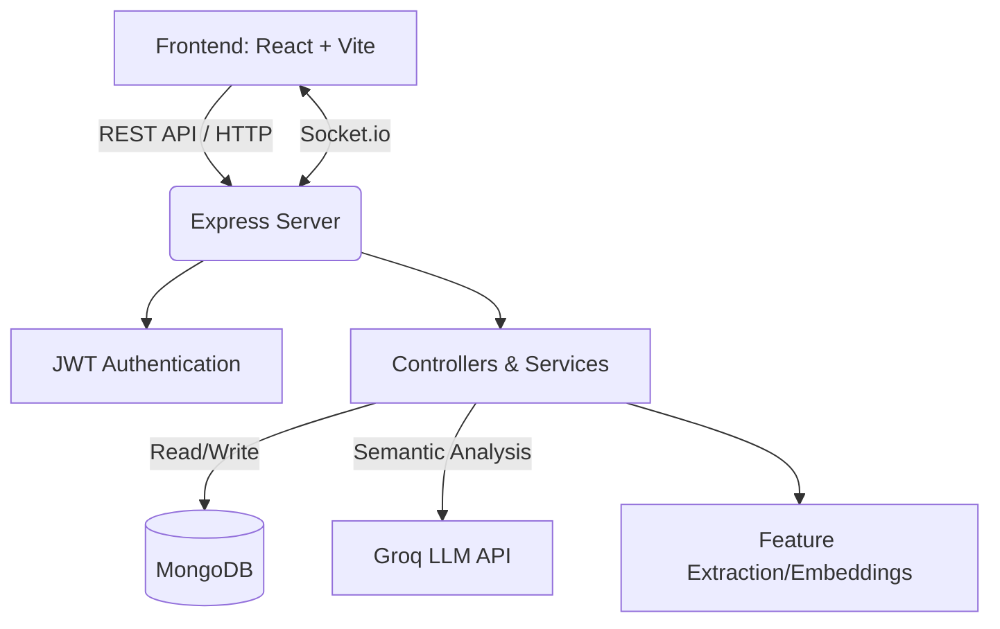

<h1 align="center">
  <br>
  FAQ Hive (Project CS18)
  <br>
</h1>

<h4 align="center">A smart, AI-driven, collaborative FAQ platform and discussion forum for modern internships.</h4>

<p align="center">
  <a href="#project-overview">Overview</a> •
  <a href="#key-features">Key Features</a> •
  <a href="#architecture">Architecture</a> •
  <a href="#tech-stack">Tech Stack</a> •
  <a href="#installation-guide">Installation</a> •
  <a href="#workflows">Workflows</a> •
  <a href="#admin-features">Admin</a> •
  <a href="#contributing">Contributing</a>
</p>

---

## Project Overview

**FAQ Hive** (internally known as CS18) is a comprehensive, full-stack knowledge management platform designed to streamline internship queries, facilitate peer-to-peer discussions, and crowdsource accurate information. By leveraging AI-powered semantic clustering, the platform automatically groups similar questions together, reducing duplicates and ensuring that interns receive unified, canonical answers. 

### Problem Statement
In large internship programs, communication channels (like Slack, Discord, or Telegram) quickly become overwhelmed with repetitive questions regarding NOCs, schedules, offer letters, and platform access. Administrators and Subject Matter Experts (SMEs) waste valuable time answering the exact same questions repeatedly. The knowledge is scattered, ephemeral, and difficult to search.

**FAQ Hive solves this by:**
1. Intercepting questions and semantically clustering them.
2. Allowing the community to collaborate on answers.
3. Using AI to generate a single "Golden Ticket" (Canonical Answer) for a cluster of similar questions.
4. Incentivizing quality contributions using a gamified reputation system (Pizza Slices and Spurti Points).

---

## Key Features

* **🤖 Semantic Clustering:** Automatically groups similar user questions using NLP embeddings to prevent duplicate threads.
* **👑 Golden Tickets:** SME-approved canonical answers that resolve entire clusters of questions at once.
* **🍕 Gamified Reputation System:** Users earn "Pizza Slices" for answering questions and "Spurti Points" for ecosystem participation.
* **🎙️ Voice Assistant:** Hands-free, accessible interaction through an integrated voice-to-text assistant.
* **🔔 Real-time Notifications:** Live WebSocket integration for immediate updates on ticket status and cluster merges.
* **🛡️ Advanced Moderation:** Admin dashboard with deduplication tools, ban/suspend capabilities, and comprehensive audit logs.
* **📱 Responsive Design:** Modern, accessible UI built with Tailwind CSS, Framer Motion, and Glassmorphism aesthetics.

---

## Architecture



## Tech Stack

* **Frontend:** React 18, Vite, Tailwind CSS, React Query (TanStack Query), Framer Motion, Lucide React.
* **Backend:** Node.js, Express.js, Mongoose.
* **Database:** MongoDB (Atlas / Local).
* **AI/NLP:** Groq API (Llama 3) for consensus generation and intent extraction.
* **Real-time:** Socket.IO.

---

## Folder Structure

```text
ocfaqproj/
├── faq-website/
│   ├── frontend/         # React SPA (Vite)
│   │   ├── src/
│   │   │   ├── components/   # Reusable UI elements
│   │   │   ├── pages/        # Route-level components
│   │   │   ├── hooks/        # Custom React hooks
│   │   │   ├── contexts/     # React Contexts (e.g., Notification)
│   │   │   └── api/          # Axios client setup
│   ├── backend/          # Node.js + Express API
│   │   ├── controllers/  # Route logic
│   │   ├── models/       # Mongoose schemas
│   │   ├── routes/       # API route definitions
│   │   ├── services/     # Business logic (AI, Sockets)
│   │   └── utils/        # Helpers (Semantic clustering, Audit)
├── .gitignore
├── LICENSE
└── README.md             # You are here
```

---

## Installation Guide

### Prerequisites
- [Node.js](https://nodejs.org/en/) (v18+ recommended)
- [MongoDB](https://www.mongodb.com/) (running locally on port 27017 or a valid MongoDB Atlas URI)
- A [Groq API Key](https://console.groq.com/) for AI features.

### 1. Clone the repository
```bash
git clone https://github.com/vicharanashala/cs18.git
cd cs18/faq-website
```

### 2. Environment Variables
Create a `.env` file in the `backend/` directory:

```env
PORT=5000
MONGO_URI=mongodb://127.0.0.1:27017/ocfaq
JWT_SECRET=your_super_secret_jwt_key
GROQ_API_KEY=your_groq_api_key_here
FRONTEND_URL=http://localhost:5173
```

Create a `.env` file in the `frontend/` directory:

```env
VITE_API_URL=http://localhost:5000/api
```

### 3. Setup and Run Backend
```bash
cd backend
npm install
node seed_local.js  # Optional: Seed the database with demo users, FAQs, and Categories
npm start
```

### 4. Setup and Run Frontend
```bash
cd frontend
npm install
npm run dev
```

The app will be available at `http://localhost:5173`.

---

## Workflows

### Authentication Flow
1. Users register/login using email and password.
2. The backend hashes passwords using `bcryptjs` and signs a JSON Web Token (JWT).
3. The frontend stores the token in `localStorage` and attaches it to the `Authorization: Bearer <token>` header via Axios interceptors.
4. Protected routes verify the JWT and attach the user payload (including role and IDs) to the `req` object.

### FAQ Management Workflow
1. **User asks a question:** Submitted via the dashboard.
2. **Semantic Clustering:** The backend generates an embedding for the question. If it has high cosine similarity (>= 0.82) to an existing "Semantic Cluster", it is merged. Otherwise, a new cluster is created.
3. **Community Answers:** Mentors and peers submit potential answers to the cluster.
4. **Consensus & Golden Ticket:** An Admin/SME reviews the cluster or uses the Groq AI integration to generate a unified consensus answer. Once approved, the cluster is locked and promoted to a "Golden Ticket" (official FAQ).

### Voice Assistant Workflow
1. User clicks the Voice Assistant microphone.
2. The browser captures audio using the standard Web Speech API (`SpeechRecognition`).
3. Transcribed text is automatically inserted into the search bar or question submission form.

### Category Management
- FAQs are tagged with Categories (e.g., "NOC", "Team Formation").
- Category statistics are dynamically aggregated (`$group` via MongoDB) ensuring that dashboard metrics always reflect live data.

---

## Admin Features

- **Deduplication Engine:** Manually or automatically merge semantically similar clusters.
- **User Management:** View all users, manage "Pizza Slices" and "Spurti Points".
- **Moderation:** Issue temporary suspensions or permanent bans for policy violations.
- **Audit Logs:** Every admin action (pizza adjustments, bans, merges) is permanently recorded in an immutable audit trail.
- **Analytics:** Access peak usage times, search failure rates, and category statistics.

## User Features

- **Public Knowledge Base:** Guests can freely search published FAQs without logging in.
- **Interactive Dashboard:** Logged-in users can participate in discussions, upvote helpful answers, and track their raised tickets.
- **Reputation Wallet:** Track earned Spurti Points and Pizza Slices based on community contributions.

---

## Security Considerations

- **Secret Management:** All credentials, API keys, and JWT secrets are injected via `.env` files and never hardcoded in the repository.
- **Input Sanitization:** Mongoose schemas enforce strong typing.
- **Role-Based Access Control (RBAC):** Distinct `authMiddleware` functions (`user`, `mentor`, `admin`) strictly protect sensitive API endpoints.
- **Audit Trails:** Administrative actions are tied to specific user IDs for accountability.

---

## Deployment Instructions

1. **Database:** Deploy MongoDB on MongoDB Atlas.
2. **Backend:** Deploy the Express server to Render, Heroku, or AWS EC2. Ensure environment variables are set in the cloud provider's dashboard.
3. **Frontend:** Build the frontend (`npm run build`) and deploy the `dist/` folder to Vercel, Netlify, or AWS S3/CloudFront.

---

## Future Roadmap

- Integration with WebRTC for live audio mentoring.
- Automated email notifications using SendGrid.
- Support for markdown rendering within community answers.

---

## Contributing

Contributions are welcome!
1. Fork the repository.
2. Create a feature branch (`git checkout -b feature/AmazingFeature`).
3. Commit your changes (`git commit -m 'Add some AmazingFeature'`).
4. Push to the branch (`git push origin feature/AmazingFeature`).
5. Open a Pull Request.

## License

This project is licensed under the MIT License - see the [LICENSE](LICENSE) file for details.