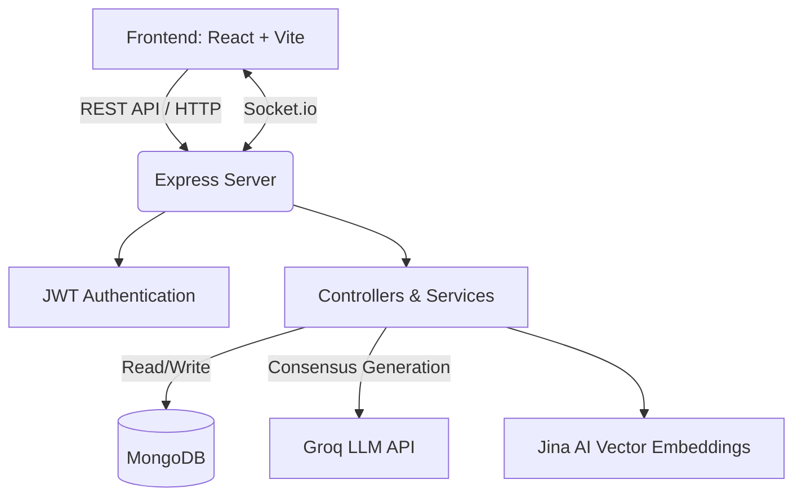

<h1 align="center">
  <br>
  FAQ Hive (Project CS18)
  <br>
</h1>

<h4 align="center">An enterprise-grade, AI-native knowledge management and support deflection platform for modern organizations.</h4>

<p align="center">
  <a href="#platform-overview">Overview</a> •
  <a href="#platform-intelligence-features">Intelligence Features</a> •
  <a href="#knowledge-lifecycle--escalation">Knowledge Lifecycle</a> •
  <a href="#gamified-knowledge-economy">Gamification</a> •
  <a href="#architecture">Architecture</a> •
  <a href="#tech-stack">Tech Stack</a> •
  <a href="#installation-guide">Installation</a> •
  <a href="#admin--moderation">Admin</a> •
  <a href="#contributing">Contributing</a>
</p>

---

## Platform Overview

**FAQ Hive** (internally known as CS18) is a comprehensive, full-stack knowledge management platform designed to streamline organizational queries, facilitate peer-to-peer discussions, and crowdsource accurate information at scale. 

In large organizations, communication channels quickly become overwhelmed with repetitive questions. Administrators and Subject Matter Experts (SMEs) waste valuable time answering the exact same queries repeatedly, while crucial knowledge remains scattered, ephemeral, and difficult to search.

**FAQ Hive solves this by:**
1. Intercepting questions at the point of entry and semantically clustering them to deflect duplicate support tickets.
2. Facilitating collaborative, community-driven answers weighted by a robust reputation system.
3. Leveraging Large Language Models (LLMs) to synthesize unified "Golden Ticket" canonical answers from clustered queries.
4. Incentivizing high-quality contributions using a gamified, dual-currency micro-economy (Pizza Slices and Spurti Points).

---

## Platform Intelligence Features

FAQ Hive is built from the ground up to minimize support overhead using advanced NLP and real-time analytics.

* **🤖 Semantic Deflection Engine (Clustering):** Intercepts user questions in real-time. Using Jina AI vector embeddings, it maps user input against a high-dimensional vector space. If a semantic match (cosine similarity >= 0.82) is detected against an active cluster, the query is automatically merged, preventing duplicate ticket creation and instantly routing the user to the ongoing discussion.
* **🧠 Consensus Confidence Generation:** When a cluster of similar questions reaches a critical mass, the integrated Groq AI (Llama 3) evaluates the community discourse and auto-generates a unified, canonical response for SME review.
* **🔍 Search Failure Analytics:** Deep telemetry on user search behavior tracks queries that yield zero results (`SearchAnalytics.js`). This enables proactive knowledge base expansion rather than reactive support.
* **📈 Emerging Topics Dashboard:** Admin intelligence dashboards track real-time query velocities, identifying trending organizational friction points before they become support crises (`DeflectionAnalytics.js`).
* **🎙️ Accessibility-First Voice Assistant:** Integrated Web Speech API enables hands-free query submission. Backend `VoiceAnalytics` comprehensively tracks latency, token usage, and transcription success rates to ensure an optimal multimodal experience.

---

## Knowledge Lifecycle & Escalation

Knowledge in FAQ Hive is not static; it evolves through a defined pipeline from user confusion to organizational policy.

### The FAQ Promotion Pipeline
1. **Raw Query:** A user submits a question.
2. **Auto-Clustering:** The system groups it with semantically identical questions.
3. **Community Resolution:** Peers and Mentors collaborate on an answer.
4. **Promotion:** High-value, resolved clusters are promoted by Admins into static, canonical FAQs (`ContributedFAQ`), permanently enriching the public knowledge base.

### 🌟 Golden Tickets (Priority Support Lane)
Not all questions can wait for community consensus. Users can spend their earned premium currency ("Spurti Points") to mint a **Golden Ticket**. 
* Golden Tickets bypass standard routing queues.
* They are weighted dynamically on admin leaderboards based on the amount of Spurti Points spent.
* Features integrated Severity Scoring (0-100) and Priority Levels (LOW to CRITICAL).

### 🔒 Privacy-Preserving Personal Issues
Distinct from public clusters, queries marked as "Personal" bypass the AI semantic clustering engine entirely. They are securely routed via a dedicated pipeline (`PersonalTicket.js`) directly to authorized Admins/HR, ensuring sensitive employee data is never vectorized or exposed to peers.

---

## Gamified Knowledge Economy

To solve the "cold start" problem of internal forums, FAQ Hive operates a sophisticated internal economy.

* **Dual-Currency System:** 
  * **Pizza Slices (Micro-Currency):** Earned through micro-actions like upvoting, participating, and answering questions.
  * **Spurti Points (Premium Currency):** A deflationary currency (converted at 6 Pizza Slices = 1 Spurti Point) used to purchase visibility boosts and Golden Tickets.
* **Reputation-Based Trust Weighting:** User reputation mathematically scales with their earned currency. Subject Matter Experts (Mentors) build category-specific expertise, ensuring that their answers carry more weight in the community consensus.
* **Real-Time Rewards Engine:** Milestone achievements, badges, and reputation increases are pushed instantly to the client via Socket.IO, triggering gamified UI feedback on the `/rewards` dashboard.

---

## Architecture



## Tech Stack

* **Frontend:** React 18, Vite, Tailwind CSS, React Query (TanStack Query), Framer Motion, Lucide React.
* **Backend:** Node.js, Express.js, Mongoose.
* **Database:** MongoDB (Atlas / Local).
* **AI/NLP:** Groq API (Llama 3) for consensus generation and Jina AI for embedding extraction.
* **Real-time:** Socket.IO for live presence, notifications, and instant merging.

---

## Folder Structure

```text
ocfaqproj/
├── faq-website/
│   ├── frontend/         # React SPA (Vite)
│   │   ├── src/
│   │   │   ├── components/   # Reusable UI elements
│   │   │   ├── pages/        # Route-level components
│   │   │   ├── hooks/        # Custom React hooks
│   │   │   ├── contexts/     # React Contexts (e.g., Notification)
│   │   │   └── api/          # Axios client setup
│   ├── backend/          # Node.js + Express API
│   │   ├── controllers/  # Route logic
│   │   ├── models/       # Mongoose schemas
│   │   ├── routes/       # API route definitions
│   │   ├── services/     # Business logic (AI, Sockets)
│   │   └── utils/        # Helpers (Semantic clustering, Audit)
├── .gitignore
├── LICENSE
└── README.md             # You are here
```

---

## Installation Guide

### Prerequisites
- [Node.js](https://nodejs.org/en/) (v18+ recommended)
- [MongoDB](https://www.mongodb.com/) (running locally on port 27017 or a valid MongoDB Atlas URI)
- A [Groq API Key](https://console.groq.com/) for AI features.

### 1. Clone the repository
```bash
git clone https://github.com/vicharanashala/cs18.git
cd cs18/faq-website
```

### 2. Environment Variables
Create a `.env` file in the `backend/` directory:

```env
PORT=5000
MONGO_URI=mongodb://127.0.0.1:27017/ocfaq
JWT_SECRET=your_super_secret_jwt_key
GROQ_API_KEY=your_groq_api_key_here
FRONTEND_URL=http://localhost:5173
```

Create a `.env` file in the `frontend/` directory:

```env
VITE_API_URL=http://localhost:5000/api
```

### 3. Setup and Run Backend
```bash
cd backend
npm install
node seed_local.js  # Optional: Seed the database with demo users, FAQs, and Categories
npm start
```

### 4. Setup and Run Frontend
```bash
cd frontend
npm install
npm run dev
```

The app will be available at `http://localhost:5173`.

---

## Admin & Moderation

Enterprise-grade moderation tools ensure platform health and knowledge accuracy.

* **Deduplication Engine:** Manually or automatically merge semantically similar clusters.
* **Knowledge Gap Detection:** Automatically identifies categories with high inquiry volume but low resolution rates.
* **Immutable Audit Logs:** Every critical action (pizza adjustments, bans, semantic merges, setting overrides) is permanently recorded (`AuditLog.js`, `ModerationLog.js`, `ActivityLog.js`) to ensure strict compliance and accountability.
* **Advanced Moderation:** Admins can issue temporary suspensions, permanent bans, or mutes with real-time enforcement via Socket.IO events (`TEMP_BAN`, `PERM_BAN`).

---

## Security Considerations

- **Secret Management:** All credentials, API keys, and JWT secrets are injected via `.env` files and never hardcoded in the repository.
- **Input Sanitization:** Mongoose schemas enforce strong typing.
- **Role-Based Access Control (RBAC):** Distinct `authMiddleware` functions (`user`, `mentor`, `admin`) strictly protect sensitive API endpoints.
- **Audit Trails:** Administrative actions are tied to specific user IDs for absolute accountability.

---

## Deployment Instructions

1. **Database:** Deploy MongoDB on MongoDB Atlas.
2. **Backend:** Deploy the Express server to Render, Heroku, or AWS EC2. Ensure environment variables are set in the cloud provider's dashboard.
3. **Frontend:** Build the frontend (`npm run build`) and deploy the `dist/` folder to Vercel, Netlify, or AWS S3/CloudFront.

---

## Future Roadmap

- Integration with WebRTC for live audio mentoring.
- Automated email notifications using SendGrid.
- Support for markdown rendering within community answers.

---

## Contributing

Contributions are welcome!
1. Fork the repository.
2. Create a feature branch (`git checkout -b feature/AmazingFeature`).
3. Commit your changes (`git commit -m 'Add some AmazingFeature'`).
4. Push to the branch (`git push origin feature/AmazingFeature`).
5. Open a Pull Request.

## License

This project is licensed under the MIT License - see the [LICENSE](LICENSE) file for details.