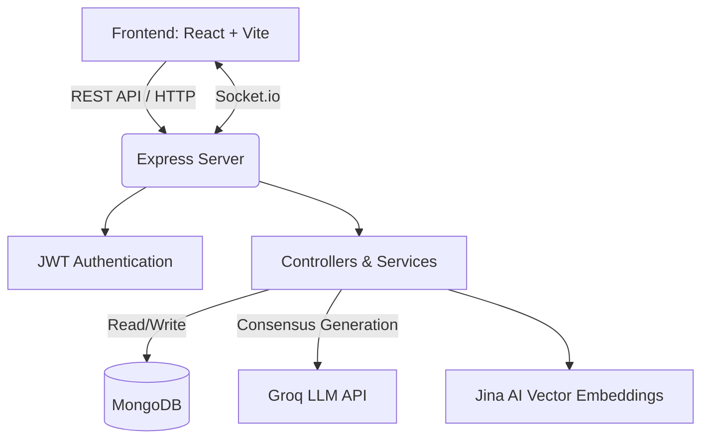

<h1 align="center">
  <br>
  FAQ Hive (Project CS18)
  <br>
</h1>

<h4 align="center">An enterprise-grade, AI-native knowledge management and support deflection platform for modern organizations.</h4>

<p align="center">
  <a href="#project-overview">Overview</a> •
  <a href="#key-features">Features</a> •
  <a href="#roles--permissions">RBAC</a> •
  <a href="#reputation-economy">Economy</a> •
  <a href="#system-architecture">Architecture</a> •
  <a href="#installation-guide">Installation</a> •
  <a href="#database-architecture">Database</a>
</p>

---

## Project Overview

**FAQ Hive** (internally known as CS18) is a comprehensive, full-stack knowledge management platform designed to streamline organizational queries, facilitate peer-to-peer discussions, and crowdsource accurate information at scale. It is a fully real-time, AI-integrated Single Page Application (SPA) utilizing the MERN stack.

## Problem Statement

In large organizations and internship programs, communication channels quickly become overwhelmed with repetitive questions. Administrators and Subject Matter Experts (SMEs) waste valuable time answering the exact same queries repeatedly, while crucial knowledge remains scattered, ephemeral, and difficult to search. FAQ Hive solves this by actively intercepting questions at the point of entry, semantically clustering them to deflect duplicate support tickets, and leveraging AI to synthesize unified canonical answers.

## Key Features

* **Semantic Deflection Engine:** Automatically groups similar user questions using NLP embeddings to prevent duplicate threads.
* **Golden Tickets:** A premium support lane for urgent queries.
* **Dual-Currency Gamification:** Users earn "Pizza Slices" for answering questions and spend "Spurti Points" for ecosystem privileges.
* **Accessibility-First Voice Assistant:** Hands-free interaction through an integrated voice-to-text assistant.
* **Real-time Notifications:** Live WebSocket integration for immediate updates on ticket status and cluster merges.
* **Advanced Moderation:** Admin dashboard with deduplication tools, ban/suspend capabilities, and comprehensive audit logs.

## Platform Intelligence

FAQ Hive is built from the ground up to minimize support overhead using advanced NLP and real-time analytics.

* **Search Deflection Engine:** Intercepts user questions in real-time. Using Jina AI vector embeddings, it maps user input against a high-dimensional vector space. If a semantic match (cosine similarity >= 0.82) is detected against an active cluster, the query is automatically merged, preventing duplicate ticket creation and instantly routing the user to the ongoing discussion.
* **Consensus Confidence Generation:** When a cluster of similar questions reaches a critical mass, the integrated Groq AI (Llama 3) evaluates the community discourse and auto-generates a unified, canonical response for SME review.
* **Voice Assistant:** Integrated Web Speech API enables hands-free query submission. Backend analytics comprehensively track latency, token usage, and transcription success rates to ensure an optimal multimodal experience.

## Knowledge Lifecycle

Knowledge in FAQ Hive is not static; it evolves through a defined pipeline from user confusion to organizational policy.

## FAQ Promotion Pipeline

1. **Raw Query:** A user submits a question.
2. **Auto-Clustering:** The system groups it with semantically identical questions.
3. **Community Resolution:** Peers and Mentors collaborate on an answer.
4. **Promotion:** High-value, resolved clusters are promoted by Admins into static, canonical FAQs (`ContributedFAQ`), permanently enriching the public knowledge base.

## Roles & Permissions

The platform relies on a strict Role-Based Access Control (RBAC) model.

* **The "User" (Student / Employee):** Can raise tickets, search FAQs, view their wallet, interact with the Bee Voice Assistant, and track their reputation. Associated with an `institution` automatically extracted from their email domain.
* **The "Mentor" (Subject Matter Expert - SME):** Everything a User can do, plus category-specific privileges. They are assigned specific expertise categories (`mentorCategories`) and track `categoryExpertise` (answers given, helpful votes, response time). Mentors can claim and resolve tickets routed to their category.
* **The "Admin":** Complete platform oversight. Admins access the `/admin/intelligence` and `/admin/settings` dashboards, manage moderation (bans/suspensions/mutes), review Golden Tickets, and promote resolved clusters into static canonical FAQs.

## Ticketing Ecosystem

The platform actively attempts to deflect, group, or prioritize queries based on user input and AI analysis.

* **Standard Tickets:** Users submit a question and are assigned a `ticketNumber`. Tickets move through statuses (`submitted` -> `under_review` -> `assigned` -> `admin_review` -> `resolved`) and are assigned an automated severity score (0-100).
* **Privacy-Preserving Personal Issues:** Distinct from public clusters, queries marked as "Personal" bypass the AI semantic clustering engine entirely. They are securely routed directly to authorized Admins/HR, ensuring sensitive employee data is never vectorized or exposed to peers.
* **🌟 Golden Tickets (Priority Support Lane):** Not all questions can wait for community consensus. Users can spend their earned premium currency ("Spurti Points") to mint a Golden Ticket. Golden Tickets bypass standard routing queues, are weighted dynamically on admin leaderboards based on the amount of Spurti Points spent, and feature integrated Priority Levels (LOW to CRITICAL).
* **Semantic Clusters:** Instead of standalone tickets, redundant questions are mapped to `SemanticCluster`s. Participants are added via `AUTO_CLUSTERED` methods, their raw questions are logged, and a unified AI auto-response is generated.

## Reputation Economy

To solve the "cold start" problem of internal forums, FAQ Hive operates a sophisticated internal economy.

* **Dual-Currency System:**
  * **Pizza Slices (Micro-Currency):** Earned through micro-actions like upvoting, participating, and answering questions.
  * **Spurti Points (Premium Currency):** A deflationary currency (converted at 6 Pizza Slices = 1 Spurti Point) used to purchase visibility boosts and Golden Tickets.
* **Reputation-Based Trust Weighting:** User reputation mathematically scales with their earned currency. Mentors build category-specific expertise, ensuring that their answers carry more weight in the community consensus.
* **Real-Time Rewards Engine:** Milestone achievements, badges, and reputation increases trigger gamified UI feedback on the `/rewards` dashboard.

## AI Pipeline

**Step-by-Step API & AI Workflow Example**
1. **Frontend Input:** User types "How to connect to office wifi?" in `/raise-ticket`.
2. **Vectorization:** Request hits `POST /api/intelligence/check-similarity`. Jina AI converts the string to a vector.
3. **Similarity Search:** Backend queries MongoDB for open `SemanticCluster`s using cosine similarity.
4. **Match & Prompt:** The backend finds "Office Wi-Fi Connection Issues" and asks the user, *"Did you mean this active discussion?"*
5. **Deflection:** The user clicks "Yes". The backend adds the `userId` to the existing cluster's `participants`.
6. **Notification:** A Socket.IO event `QUERY_CLUSTERED` is emitted, seamlessly redirecting the user to the ongoing discussion.

## Real-Time Infrastructure

The platform feels "alive" due to its comprehensive websocket integration. 
* **The Notification Service:** A central factory (`Notification.js`) persists events to MongoDB and instantly emits them to specific user rooms (`user:${userId}`).
* **Event Triggers:** Handles ticket updates (`TICKET_ANSWERED`), gamification (`BADGE_EARNED`), moderation (`TEMP_BAN`), and engagement (`QUERY_TRENDING`).

## Analytics & Insights

The system logs data continuously to optimize the AI and user experience:
* **Search Failure Analytics (`SearchAnalytics.js`):** Deep telemetry tracks queries that yield zero results, enabling proactive knowledge base expansion.
* **Emerging Topics Dashboard (`DeflectionAnalytics.js`):** Admin intelligence dashboards track real-time query velocities and how effectively the AI prevents redundant tickets.
* **Voice Analytics (`VoiceAnalytics.js`):** Monitors Bee Voice Assistant queries, token usage, latency, and success rates.

## System Architecture



### "3-Tier Caution" Design Philosophy
The backend codebase is structured around a strict internal caution system for developers:
- **🟢 Tier 1 (Safe):** Pure UI components (React/Tailwind).
- **🟡 Tier 2 (Caution):** Interlocking systems like AI routing and API responses. Changing these breaks the UI.
- **🔴 Tier 3 (Critical):** Core security, Mongoose `pre('save')` hooks (like password hashing), and Socket listeners. Modifying these risks catastrophic failure.

## Tech Stack

* **Frontend:** React 18, Vite, Tailwind CSS, React Query (TanStack Query), Framer Motion, Lucide React.
* **Backend:** Node.js, Express.js, Mongoose.
* **Database:** MongoDB (Atlas / Local).
* **AI/NLP:** Groq API (Llama 3) for consensus generation and Jina AI for embedding extraction.
* **Real-time:** Socket.IO for live presence, notifications, and instant merging.

## Folder Structure

```text
ocfaqproj/
├── faq-website/
│   ├── frontend/         # React SPA (Vite)
│   │   ├── src/
│   │   │   ├── components/   # Reusable UI elements
│   │   │   ├── pages/        # Route-level components
│   │   │   ├── hooks/        # Custom React hooks
│   │   │   ├── contexts/     # React Contexts (e.g., Notification)
│   │   │   └── api/          # Axios client setup
│   ├── backend/          # Node.js + Express API
│   │   ├── controllers/  # Route logic
│   │   ├── models/       # Mongoose schemas
│   │   ├── routes/       # API route definitions
│   │   ├── services/     # Business logic (AI, Sockets)
│   │   └── utils/        # Helpers (Semantic clustering, Audit)
├── .gitignore
├── LICENSE
└── README.md             # You are here
```

## Installation Guide

### Prerequisites
- [Node.js](https://nodejs.org/en/) (v18+ recommended)
- [MongoDB](https://www.mongodb.com/) (running locally on port 27017 or a valid MongoDB Atlas URI)
- A [Groq API Key](https://console.groq.com/) for AI features.

### 1. Clone the repository
```bash
git clone https://github.com/vicharanashala/cs18.git
cd cs18/faq-website
```

### 2. Environment Variables
Create a `.env` file in the `backend/` directory:

```env
PORT=5000
MONGO_URI=mongodb://127.0.0.1:27017/ocfaq
JWT_SECRET=your_super_secret_jwt_key
GROQ_API_KEY=your_groq_api_key_here
FRONTEND_URL=http://localhost:5173
```

Create a `.env` file in the `frontend/` directory:

```env
VITE_API_URL=http://localhost:5000/api
```

### 3. Setup and Run Backend
```bash
cd backend
npm install
node seed_local.js  # Optional: Seed the database with demo users, FAQs, and Categories
npm start
```

### 4. Setup and Run Frontend
```bash
cd frontend
npm install
npm run dev
```

The app will be available at `http://localhost:5173`.

## Workflows

### Authentication Flow
1. Users register/login using email and password.
2. The backend hashes passwords using `bcryptjs` and signs a JSON Web Token (JWT).
3. The frontend stores the token in `localStorage` and attaches it to the `Authorization: Bearer <token>` header via Axios interceptors.
4. Protected routes verify the JWT and attach the user payload (including role and IDs) to the `req` object.

### FAQ Management Workflow
1. **User asks a question:** Submitted via the dashboard.
2. **Semantic Clustering:** The backend generates an embedding for the question. If it has high cosine similarity (>= 0.82) to an existing "Semantic Cluster", it is merged. Otherwise, a new cluster is created.
3. **Community Answers:** Mentors and peers submit potential answers to the cluster.
4. **Consensus & Golden Ticket:** An Admin/SME reviews the cluster or uses the Groq AI integration to generate a unified consensus answer. Once approved, the cluster is locked and promoted to a "Golden Ticket" (official FAQ).

### Category Management
- FAQs are tagged with Categories (e.g., "NOC", "Team Formation").
- Category statistics are dynamically aggregated (`$group` via MongoDB) ensuring that dashboard metrics always reflect live data.

## Admin Features

Enterprise-grade moderation tools ensure platform health and knowledge accuracy.
* **Intelligence Dashboard (`/admin/intelligence`):** Specialized dashboard to monitor AI deflection rates, voice analytics, and search metrics.
* **Deduplication Engine:** Manually or automatically merge semantically similar clusters.
* **Knowledge Gap Detection:** Automatically identifies categories with high inquiry volume but low resolution rates.
* **System Settings (`SystemSettings.js`):** An admin-configurable singleton managing global flags like `beeEnabled`, `beeSystemPrompt`, and `publicFAQEnabled`.
* **Advanced Moderation & Audit Logs:** Admins can issue temporary suspensions, permanent bans, or mutes with real-time enforcement via Socket.IO events (`TEMP_BAN`, `PERM_BAN`). Every critical action is permanently recorded (`AuditLog.js`, `ModerationLog.js`, `ActivityLog.js`).

## User Features

* **Public & Protected Hubs:** Guests can access the public FAQ directory (`/faqs`), while authenticated users access a personalized dashboard showing active tickets and trending clusters.
* **Gamified Wallet & Rewards:** Dedicated pages (`/wallet`, `/rewards`) act as ledgers for earned/spent Pizza Slices and Spurti Points.
* **Interactive Ticket Submissions:** The `/raise-ticket` form provides real-time AI similarity suggestions "on-type". Users can also use the `/golden-ticket` premium UI to bid Spurti Points for immediate help.
* **Peer Directory:** Browse and view profiles via the `/intern-directory` and `/intern-profile` routes.

## Database Architecture

The data layer accurately maps to the product capabilities via strictly typed Mongoose models:
* **User:** Stores `email`, `role`, `pizzaSlices`, `spurtiPoints`, `reputation`, `institution`, and `categoryExpertise` (Map) for Mentors.
* **Ticket:** Tracks `ticketNumber`, `userId`, `status`, `severity` (0-100), and maintains a polymorphic `referenceId` for routing.
* **SemanticCluster:** Central deflection model tracking `canonicalQuestion`, `aiGeneratedAnswer`, an array of `participants` (tracking `joinMethod`), and an array of raw `relatedQueries`.
* **GoldenTicket:** High-priority schema tracking `spurtiSpent` (which maps to a virtual `leaderboardWeight`), `severityScore`, and `priorityLevel`.
* **Notification:** Robust schema handling exhaustive event enums, dynamic `metadata`, and broadcast expiries.
* **Analytics & Logs:** Specialized schemas (`SearchAnalytics`, `VoiceAnalytics`, `DeflectionAnalytics`, `AuditLog`) handling telemetry.

## Security Considerations

- **Secret Management:** All credentials, API keys, and JWT secrets are injected via `.env` files and never hardcoded in the repository.
- **Input Sanitization:** Mongoose schemas enforce strong typing.
- **Role-Based Access Control (RBAC):** Distinct `authMiddleware` functions (`user`, `mentor`, `admin`) strictly protect sensitive API endpoints.
- **Audit Trails:** Administrative actions are tied to specific user IDs for absolute accountability.

## Deployment Instructions

1. **Database:** Deploy MongoDB on MongoDB Atlas.
2. **Backend:** Deploy the Express server to Render, Heroku, or AWS EC2. Ensure environment variables are set in the cloud provider's dashboard.
3. **Frontend:** Build the frontend (`npm run build`) and deploy the `dist/` folder to Vercel, Netlify, or AWS S3/CloudFront.

## Future Roadmap

- Integration with WebRTC for live audio mentoring.
- Automated email notifications using SendGrid.
- Support for markdown rendering within community answers.

## Contributing

Contributions are welcome!
1. Fork the repository.
2. Create a feature branch (`git checkout -b feature/AmazingFeature`).
3. Commit your changes (`git commit -m 'Add some AmazingFeature'`).
4. Push to the branch (`git push origin feature/AmazingFeature`).
5. Open a Pull Request.

## License

This project is licensed under the MIT License - see the [LICENSE](LICENSE) file for details.